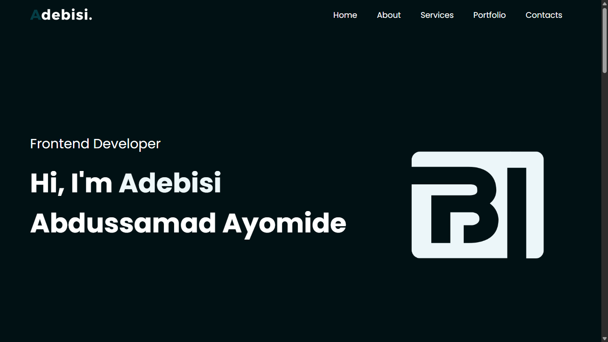

# 🌐 Adebisi Abdussamad Ayomide – Personal Portfolio

Welcome to my personal portfolio website! This is a responsive and interactive website built to showcase my work, skills, and contact information as a **Frontend Developer** passionate about crafting clean and user-friendly web experiences.

## 🚀 Live Site

👉 [Visit My Portfolio](https://adebisiabdussamadayo.netlify.app/)

---

## 📌 About

This portfolio highlights:

-   My bio and technical background
-   Services I offer
-   Projects I've built (with live links)
-   Contact information and social links
-   Integrated contact form (Google Sheets backend)

---

## 🛠️ Built With

-   **HTML5**
-   **CSS3**
-   **JavaScript (ES6+)**
-   **Responsive Design**
-   **Font Awesome Icons**
-   **Netlify (for deployment)**
-   **Google Sheets (as form backend)**

---

## ✨ Features

-   Mobile-first responsive layout
-   Interactive tabbed sections (Skills, Experience, Education)
-   Live project previews with external links
-   Integrated form submission using Google Apps Script
-   Smooth navigation with internal anchor links
-   Downloadable resume
-   Social media integration

---

## 📂 Folder Structure

personal-portfolio/
├── img/ # Folder containing image assets
├── index.html # Main HTML file
├── styles.css # Custom CSS styles
└── Readme.md # Project documentation

---

## 📸 Preview

---

## 📬 Contact

If you'd like to connect, feel free to reach out:

-   📧 Email: [aadebisiaayatullah@gmail.com](mailto:aadebisiaayatullah@gmail.com)
-   📞 Phone: 09133714401
-   🐦 Twitter: [@adebisicodes](https://x.com/adebisicodes)
-   📸 Instagram: [@adebisicodes](https://instagram.com/adebisicodes)
-   💬 WhatsApp: [Chat with me](https://wa.link/a9ukxm)

---

## 📄 License

This project is open for inspiration and educational purposes. If you'd like to use or contribute, feel free—but give credit where it's due. 😊

---

## 🙌 Acknowledgements

-   [Frontend Mentor](https://www.frontendmentor.io/) – for design inspiration and challenges
-   [MDN Web Docs](https://developer.mozilla.org/) – for technical references
-   [Font Awesome](https://fontawesome.com/) – for icons

---

> Designed and developed with 💻 by **Adebisi Abdussamad Ayomide**
